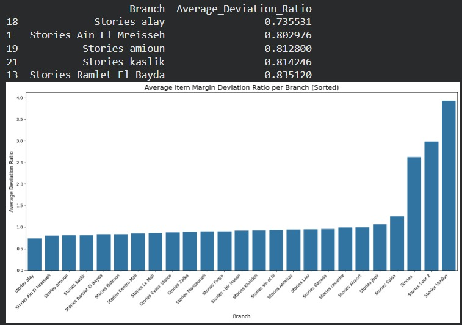
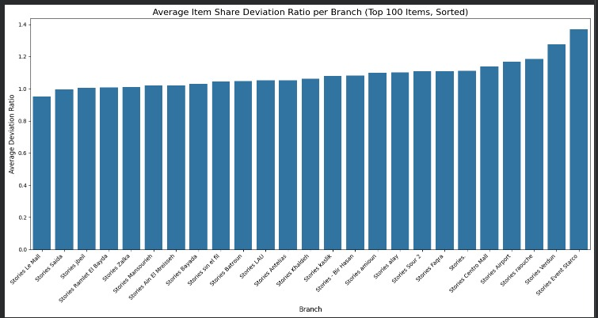

# Stories-Analysis-EECE-490
Analysis of Stories Coffee sales data from 25 branches to uncover trends, insights, and patterns. Includes data cleaning, exploratory analysis, modeling, and visualizations for business decision support.
For the CLASSIFICATION IDEA: all the snippets are included in this collab page, and all the cleaned data are attached under the files.

https://colab.research.google.com/drive/1Axhsuemmginr2xaQQvgaNB5gLaoI0Mx4?usp=sharing

The files were organized in excel and converted back to CSV format. Also, for the files F014 and F191, addition featues such as division and group and location were added to orgmanize the data.

CLASSIFICATION IDEA:

# Product Optimizer – Stores Coffee Chain

This project helps a Lebanese coffee shop chain (“Stores”) make data-driven
decisions about promotions, pricing, and menu optimization.

We built a simple, explainable framework based on two normalized indices:

R (Relative Demand Index)  -> measures item popularity
M (Relative Margin Index)  -> measures item profitability

Together, they generate clear product-level recommendations.

## Methodology

Retail performance depends on two factors:

1) Demand (popularity)
2) Profit efficiency (margin)

Because branches differ in size, we normalize all metrics to remove
scale bias and enable fair comparison.

## Relative Demand Index (R)

Step 1 – Revenue Share inside branch:

Share(i,b) = Revenue(i,b) / TotalRevenue(b)

Step 2 – Benchmark using median across branches:

MedianShare(i) = median_b( Share(i,b) )

Step 3 – Relative Demand:

R(i,b) = Share(i,b) / MedianShare(i)

Interpretation:
R > 1  -> Item is more popular than typical
R < 1  -> Item is underperforming

## Relative Margin Index (M)

Step 1 – Item Margin:

Margin(i,b) = Profit(i,b) / Revenue(i,b)

Step 2 – Benchmark using median across branches:

MedianMargin(i) = median_b( Margin(i,b) )

Step 3 – Relative Margin:

M(i,b) = Margin(i,b) / MedianMargin(i)

Interpretation:
M > 1  -> Higher margin than typical
M < 1  -> Lower margin than peers

## Why Use Median Instead of Mean?

Retail data contains outliers (e.g., high-traffic branches).
The median is more robust and provides a stable benchmark for normalization.

## Decision Matrix

If R > 1 and M > 1:
-> Popular and profitable
-> Promote or possibly raise price

If R < 1 and M > 1:
-> Profitable but weak demand
-> Promote or improve visibility

If R > 1 and M < 1:
-> Popular but low margin
-> Avoid discounting or review pricing

If R < 1 and M < 1:
-> Weak and low profit
-> Consider removing

## Why This Works

An item is valuable only if it performs well in demand,
profitability, or both.

By separating popularity (R) from profitability (M),
we avoid common retail mistakes such as:

- Discounting already popular low-margin items
- Ignoring high-margin items with low visibility
- Keeping weak SKUs that reduce operational efficiency

The result is a simple, explainable,
and data-driven product optimization engine.

By separating popularity (R) from profitability (M), the system avoids common retail mistakes such as discounting already popular low-margin items or ignoring high-margin items with low visibility. The result is a simple, explainable, and data-driven product optimization engine.

## Visual Results

### Seasonality Analysis
This plot highlights seasonal sales trends, helping identify peak and low-demand periods across the year. This is from file 134.

### Average Store Profitability per Store
This plot compares overall branch margins, highlighting which stores operate more efficiently and which require optimization.

### R Value Distribution
This visualization shows the distribution of the Relative Demand Index (R), indicating how product popularity varies across branches.

### M Value Distribution
This plot displays the Relative Margin Index (M), illustrating how product profitability differs compared to other stores.

### Store Performance with Average R Value
This chart evaluates overall store performance using average demand strength, showing which branches sell stronger-performing product mixes.

### Final Classification of Product Clustering
This scatter plot maps products based on R (popularity) and M (profitability), clearly separating items into strategic decision categories. According to the decion matrix we can recommend managers to change price, promote, review pricing, or consider removing the product.

There are other images included in the files
