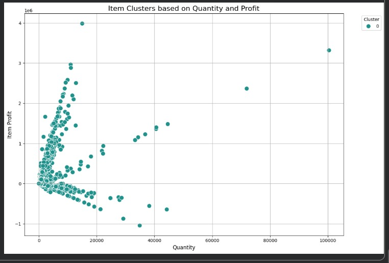
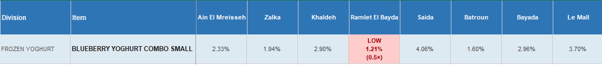
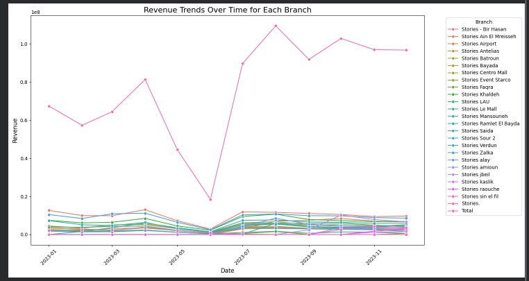
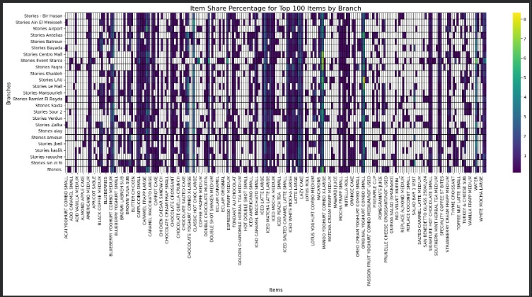
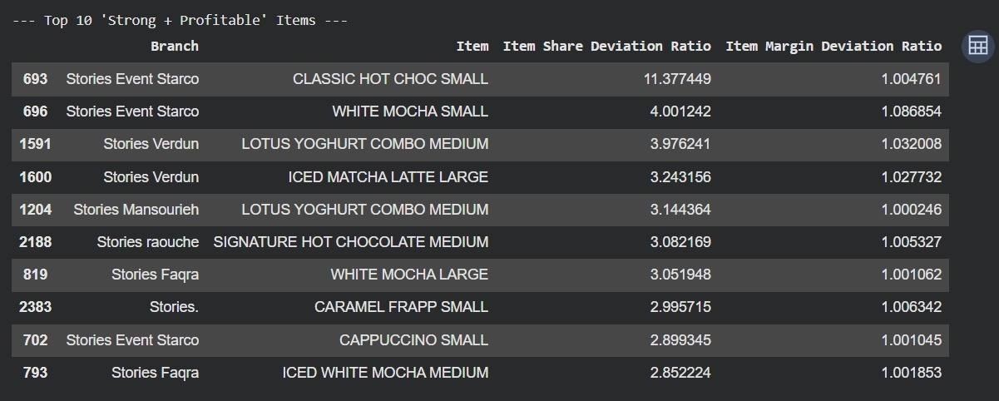
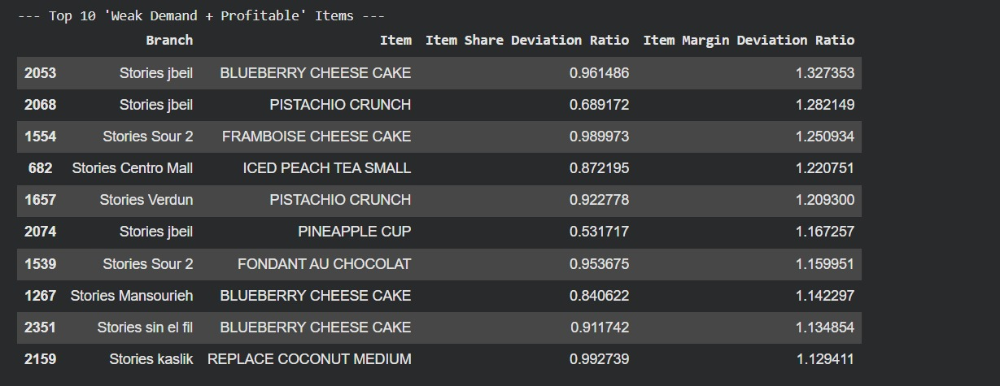
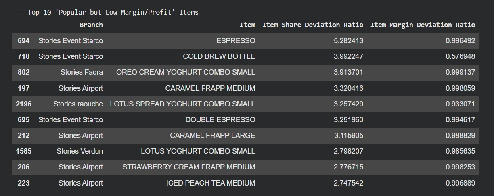
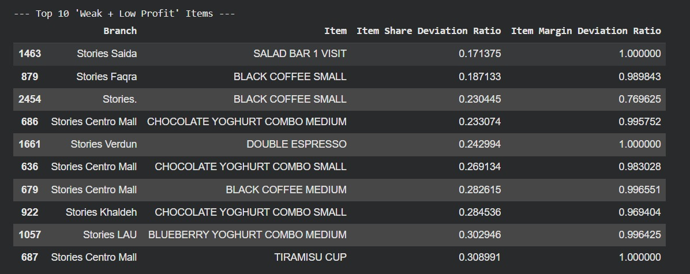

# Stories-Analysis-EECE-490
Analysis of Stories Coffee sales data from 25 branches to uncover trends, insights, and patterns. Includes data cleaning, exploratory analysis, modeling, and visualizations for business decision support.
For the CLASSIFICATION IDEA: all the snippets are included in this collab page, and all the cleaned data are attached under the file *CLEANED_REVIEWED_NEW_DATA.zip*

https://colab.research.google.com/drive/1Axhsuemmginr2xaQQvgaNB5gLaoI0Mx4?usp=sharing

# Data Cleaning and Review:
The provided data were reports grouped by categories and sub-categories. And separated by page numbers and repeated headers, with different issue dates. The files were organized in excel and converted back to CSV format. In some of the files, like F014 and F191, additional featues such as division, group and branch (Stories location) were added to the raw data. We also verified the correctness of the cleaned data by comaparing existing totals with newly created totals (like comparing sum of the month with the provided total of the year from the POS system).
Not all data was needed, and many of the data were dropped, like inconsitent data, and outliers. To remove outliers, we considered only the top 100 items sold (by revenue), as these are the meaning full items in each store (like coffee, yoghurts ...). From the data statistics, we found that in the main stores, only 15 items contributed to about 30% of the revenue of that branch.

From the data directly, we observe three clear linear bands in the Profit vs Quantity plot, reflecting different unit margin structures implemented by Stores Café.

Items seem to naturally cluster into high-slope (high-margin), medium-slope (moderate-margin), and negative-slope (loss-making) groups, suggesting structured pricing tiers and potential pricing inconsistencies.

# Classification Idea: Product Optimizer – Stories Coffee Chain

This project helps the coffee shop chain (“Stories”) make data-driven
decisions about promotions, pricing, and menu optimization.

We built a simple, explainable framework based on two normalized indices:

R (Relative Demand Index)  -> measures item popularity
M (Relative Margin Index)  -> measures item profitability

Together, they generate clear product-level recommendations.

## Methodology

Retail performance depends on two factors:

1) Demand (popularity)
2) Profit efficiency (margin)

Because branches differ in size, we <ins>normalize</ins> all metrics to remove
scale bias and enable fair comparison.

## Relative Demand Index (R)
In this section, i refers to an item and b to a branch.
Step 1 – Revenue Share inside branch:

Share(i,b) = Revenue(i,b) / TotalRevenue(b)

Step 2 – Benchmark using median across branches:

MedianShare(i) = median_b( Share(i,b) )

Step 3 – Relative Demand:

R(i,b) = Share(i,b) / MedianShare(i)

Interpretation:
R > 1  -> Item is more popular than typical branch (median share of that item over all branches)
R < 1  -> Item is underperforming

### Example – Low R in Khaldeh Branch

This figure shows an example of a low Item Share Percentage for the *Ramlet El Bayda* branch compared to the other eight top-performing branches (R = 0.5), indicating that this item underperforms in popularity in this store, relative to its typical distribution across the top 8 stores.

Thid could bring attention to that item in that branch, which can help management decide where to look at. 

## Relative Margin Index (M)

Step 1 – Item Margin:

Margin(i,b) = Profit(i,b) / Revenue(i,b)

Step 2 – Benchmark using median across branches:

MedianMargin(i) = median_b( Margin(i,b) )

Step 3 – Relative Margin:

M(i,b) = Margin(i,b) / MedianMargin(i)

Interpretation:
M > 1  -> Higher margin than typical
M < 1  -> Lower margin than peers

R ~ 1 or M ~ 1 is very typical and indicates a product with similar share over all branches, usually outliers are > 1.4 or < 0.75

## Why Use Median Instead of Mean?

Retail data contains outliers (e.g., high-traffic branches).
The median is more robust and provides a stable benchmark for normalization.

## Decision Matrix

If R > 1 and M > 1:
-> Popular and profitable
-> Promote or possibly raise price

If R < 1 and M > 1:
-> Profitable but weak demand
-> Promote or improve visibility

If R > 1 and M < 1:
-> Popular but low margin
-> Avoid discounting or review pricing

If R < 1 and M < 1:
-> Weak and low profit
-> Consider removing

## Why This Works

An item is valuable only if it performs well in demand,
profitability, or both.

By separating popularity (R) from profitability (M),
we avoid common retail mistakes such as:

- Discounting already popular low-margin items
- Ignoring high-margin items with low visibility
- Keeping weak SKUs that reduce operational efficiency

The result is a simple, explainable,
and data-driven product optimization engine.

By separating popularity (R) from profitability (M), the system avoids common retail mistakes such as discounting already popular low-margin items or ignoring high-margin items with low visibility. The result is a simple, explainable, and data-driven product optimization engine.

## Visual Results

### Seasonality Analysis
This plot highlights seasonal sales trends, helping identify peak and low-demand periods across the year. This is from file 134.

### R Value Distribution
This visualization shows the distribution of the Relative Demand Index (R), indicating how product popularity varies across branches. Some vertical green bars indicate products that perform well over all brnaches, like *ORIGINAL YOGHURT COMBO SMALL* which seems to be the top among all items (about 3% of all sales).

### M Value Distribution
This plot displays the Relative Margin Index (M), illustrating how product profitability differs compared to other stores. The M tells us about the most profitable items over all branches.

### Store Performance with Average R Value
This chart evaluates overall store performance using average demand strength, showing which branches sell stronger-performing product mixes.

### Average Store Profitability per Store
This plot compares overall branch margins, highlighting which stores operate more efficiently and which require optimization.

### Final Classification of Product Clustering
This scatter plot maps products based on R (popularity) and M (profitability), clearly separating items into strategic decision categories. According to the decion matrix we can recommend managers to change price, promote, review pricing, or consider removing the product.

There are other images included in the files

## Example Items by Category
In files, there is a file that contains R and M for all items in all branches *OUTPUT_FILE_PER_CATEGORY.zip* 
Below are sample products from each classification group generated by our R–M decision matrix.

### Example 1 – Popular & Profitable (R > 1, M > 1)
These items perform strongly in both demand and profitability and are ideal candidates for promotion or potential price optimization.

### Example 2 – Profitable but Weak Demand (R < 1, M > 1)
These items have strong margins but lower popularity, indicating an opportunity for better visibility or targeted promotion.

### Example 3 – Popular but Low Margin (R > 1, M < 1)
These products sell well but generate lower profit margins, suggesting caution with discounts and potential pricing review.

### Example 4 – Weak & Low Profit (R < 1, M < 1)
These items underperform in both demand and profitability and may be candidates for removal or reformulation.

# Seasonality Idea:
Colab NoteBook: https://colab.research.google.com/drive/1wJzKJIWa1JtPZ__nzpzjW495d5-dts7i?authuser=1#scrollTo=012ce341
## Seasonality Analysis (Branch-Level Insights)

**Branches Analyzed:**  
12 branches were selected based on consistent data availability throughout 2025. Some branches were excluded because they were not in operation or had insufficient data.

**Method:**  
Seasonality was quantified using a **linear regression model** on sine and cosine transformations of the month number (`Month_sin`, `Month_cos`) to capture cyclical patterns in monthly revenue.

**Metrics Extracted:**
- **Alpha (Intercept):** Average sales level independent of seasonality  
- **Seasonality Strength (S):** Magnitude of seasonal variation  
- **Peak Month:** Month with highest sales  

**Key Findings:**
- **Highest Average Sales:** `Stories Ain El Mreisseh` and `Stories Zalka` peaked in January.  
- **Strongest Seasonal Variation:** `Stories Ramlet El Bayda` showed the most pronounced seasonality (peak in October). Other branches with significant seasonal patterns included `Ain El Mreisseh`, `Zalka`, `Khaldeh`, `Verdun`, and `Faqra`.  
- **Diverse Peak Months:** Peak sales months varied across branches (January → October → November → December).  
- **Relative Seasonality Impact:** `Stories Faqra`, despite lower average sales, had strong seasonal dependence, peaking in April.  
- **Stable Sales:** `Stories Antelias` exhibited low seasonality, indicating steady sales throughout the year.  

**Visualization:**  
Line plots were generated to illustrate monthly revenue trends and confirm peak months and seasonal patterns for each branch.

> Technical Note: Some pandas warnings appeared during computation due to version compatibility, but results were verified and unaffected.

